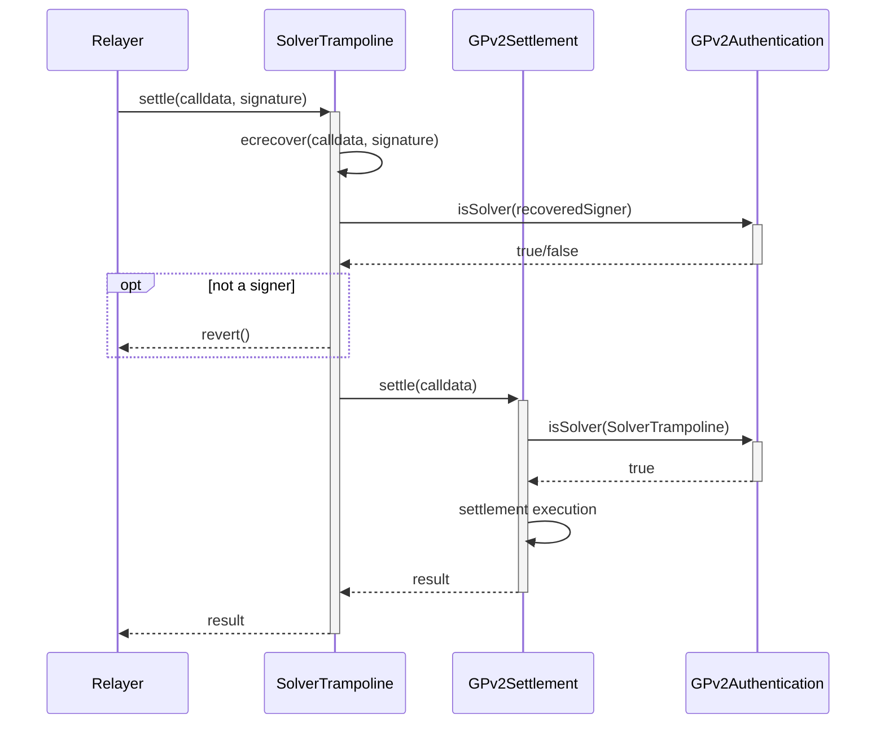

# Solver Trampoline

The `SolverTrampoline` contract is a thin settlement wrapper contract that
executes settlements authenticated by signature instead of `msg.sender`. This
allows for permission-less settlement transaction execution whereby a solver
signs settlement calldata, but any account can execute it.

In particular, this is useful for executing settlement with transaction relay
networks (such as the Gelato relay network and Infura ITX) without any
additional trust assumptions about the transaction executor.

## Transaction Flow

